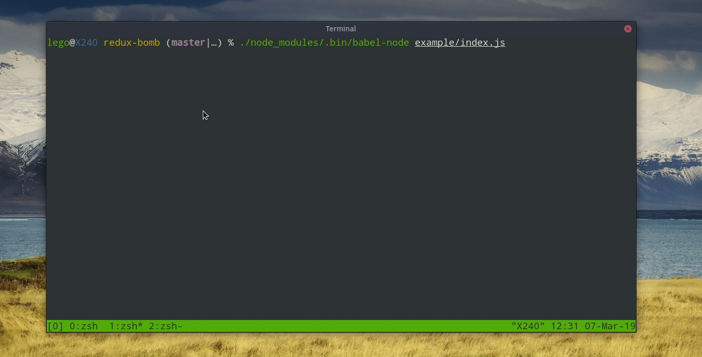

# Redux Bomb

> This is a useless middleware.

This middleware will fork 2 more actions when every dispatching.

## Installation

```sh
yarn add redux-bomb
```

## Get Started

```js
import { createStore, applyMiddleware } from 'redux';
import bomb from '../src';

const counter = (state = 0, action) => {
  if (action.type === 'INCREMENT') return state + 1;

  return state;
};

const store = createStore(counter, applyMiddleware(bomb));

store.subscribe(() => console.log(store.getState()));

store.dispatch({ type: 'INCREMENT' });

/*
  A beautiful flushing screen
*/
```



### with-delay

It can set delay in milesecond.

```js
  applyMiddleware(bomb.delay(1000));
```

That it.

**DO NOT USE IT.**
